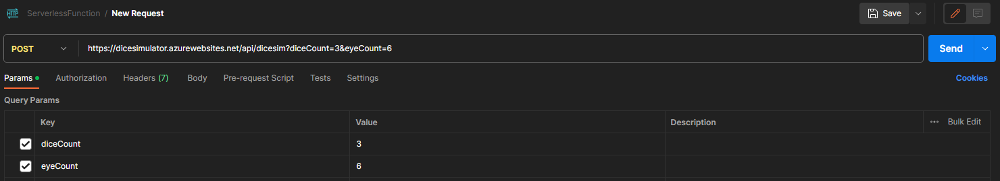
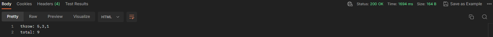

# DiceSim Dokumentation

## Aufgabenstellung
Erstellen Sie auf der Azure Plattform eine Serverless Function mit Node.js und HttpTrigger, die mehrere Parameter via HTTP erhält und dann ein individuell berechnetes/erstelltes, sinnvolles Ergebnis zurückgibt. Stellen
Sie sicher, dass Sie den Code vollständig verstehen und erklären können.
### Idee 
Wir haben uns dafür entschieden einen Würfelgenerator für das Spielprinzip Dungeon&Dragons zuerstellen, falls man sein physisches Würfelset vergessen hat. Hierbei können mehrere Würfel mit unterschiedlichen Seitenanzahlen gewürfelt werden, je nach dem welcher Würfeltyp verlangt wird. Dabei können jedoch pro Wurf nur Würfel mit gleicher Seitenanzahl verwendet werden (wie im Spielprinzip Dungeon&Dragons).

## Umsetzung
### Logik
Zuerst wurde eine HelloWorld Serverless Function als Beispiel herangezogen um zu testen, ob die Kommunikation mit Azur über Postman funktioniert. Nach dem Sichergestellt wurde, dass die Serveless Function Kommunikation steht, wurde die Logik für den Würfelwurf implementiert. 
[Link zum Code](https://github.com/LaurinBrinkmann/WebProg/blob/main/DiceSimulator/src/functions/dicesim.js)

### Fehlerbehandlung
Über eine If-Abfrage wurde geklärt, ob der Nutzer beim Senden des Requests vergessen hat, Parameter anzugeben. Sobald der Nutzer keinen Interger-Wert übergibt wird eine 400-Fehlermeldung geworfen, mit der Bitte richtige Parameter zu übergeben. Wenn ein korrekter Request abgeschickt wurde wird eine 200-Statusmeldung zurückgeben.
### Output
Als Letztes wurde sich um das verschönern des Outputs gekümmert, um eine verständliche Ausgabe über den Würfelwurf zuerhalten.

## Verwendung über Postman
Um die Serverless Function aufzurufen wird in Postman ein POST-Request über folgende URL gesendet
in diesem Beispiel werden 3 Würfel mit der höchst möglichen Augenzahl 6 geworfen:
https://dicesimulator.azurewebsites.net/api/dicesim?diceCount=3&eyeCount=6



Nach dem die Anfrage gesendet wurde erhält man als Response einmal den Wurf mit den Augenzahlen der einzelnen Würfel (throw) sowie die summierte Augenanzahl (total). Zusätzlich erhält man eine 200 Statusmeldung für eine korrekte Response.



## Erfahrungen mit AI
Unsere Erfahrung mit AI haben wir durch die Verwendung von GitHubCopilot gemacht. Dieser half uns Teils bei der Logik, da Vorschläge für die Zufälligkeit der Augenzahl gemacht wurde:
```javascript
Math.floor(Math.random()
```
Ebenfalls half uns GitHubCopilot bei Syntax Schwierigkeiten in JavaScript.
